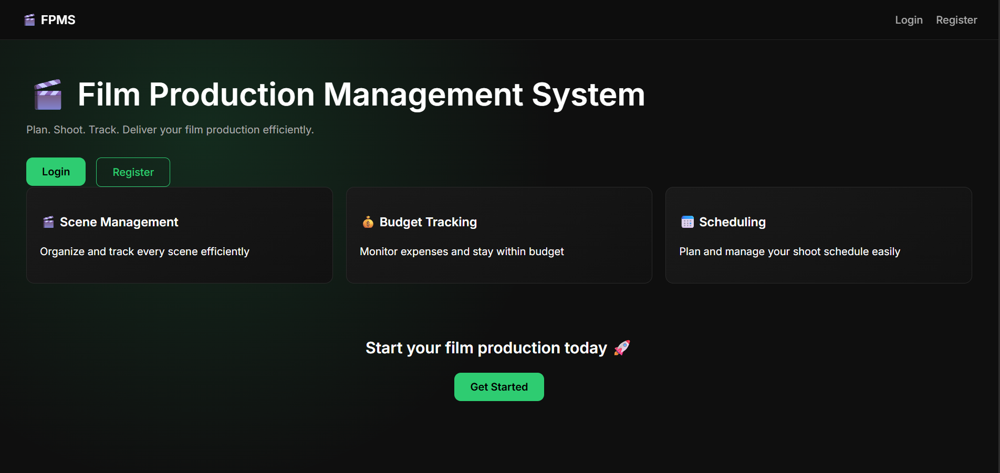

# Film Production Management System (FPMS)

A full-stack web application for managing film production workflows.

Features:
- User Authentication
- Project Management
- Scene Tracking
- Budget Management
- Shooting Schedule Management
- Crew Management
- Analytics Dashboard
- Responsive Mobile UI

Tech Stack:
Frontend:
- React
- React Router
- Vite

Backend:
- Node.js
- Express.js
- MongoDB

Deployment:
- Vercel (Frontend)
- Render (Backend)

## Screenshots

### Home

### Dashboard

### Scene Management

### Budget Management
