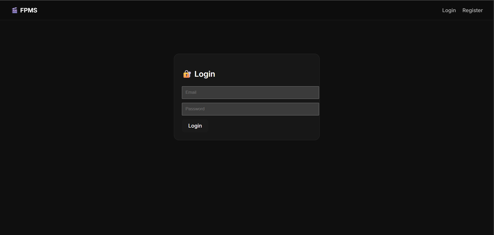
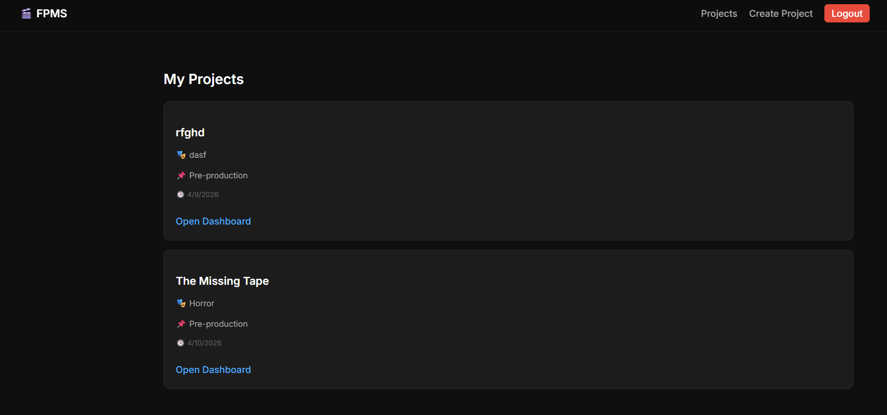
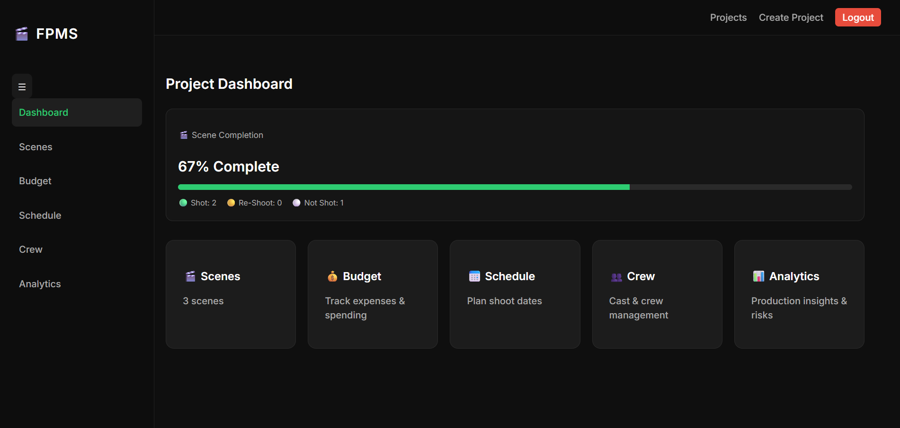
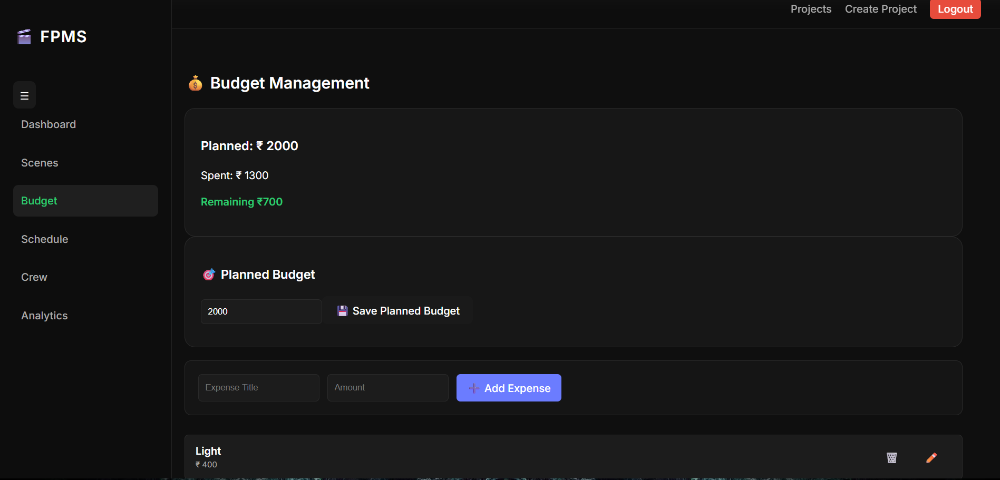

🎬 Film Production Management System (FPMS) - Frontend

A React-based frontend application for managing film production workflows, including project management, scene tracking, budgeting, scheduling, crew management, and analytics.

🚀 Features

🔐 Authentication

- User Login
- User Registration
- Protected Routes

🎥 Project Management

- Create Projects
- View Projects
- Manage Production Workflow

🎬 Scene Management

- Add Scenes
- Edit Scenes
- Delete Scenes
- Track Scene Status

💰 Budget Management

- Planned Budget Tracking
- Expense Management
- Budget Analytics

📅 Schedule Management

- Shooting Schedule Tracking
- Status Monitoring
- Timeline Management

👥 Crew Management

- Add Crew Members
- Assign Roles
- Manage Production Team

📊 Analytics Dashboard

- Scene Progress
- Budget Health
- Schedule Health
- Burn-Down Charts

---

🛠️ Tech Stack

- React.js
- React Router DOM
- Recharts
- React Toastify
- CSS
- Vite

---

📦 Installation

Clone the repository:

git clone https://github.com/abhaym10/fpms-frontend

Install dependencies:

npm install

Run locally:

npm run dev

---

🌐 Deployment

Frontend deployed using Vercel.

---

👨‍💻 Author

Abhay Murali

Built as a full-stack portfolio project.

## Screenshots

### Login Page

### Projects Page

### Dashboard

### Budget Tracking
